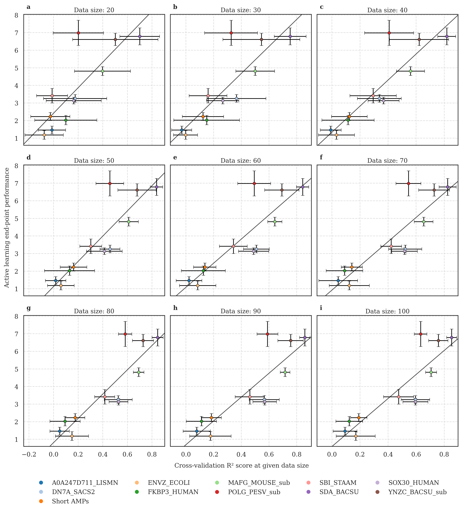

# SCARSE: Small-sample Classification And Regression Solution for low-resource peptide Engineering
<p align="center">
  
</p>

## Abstract
Being able to predict peptide properties under low-data conditions is paramount for early-stage AI-guided peptide engineering. In this study, we introduce SCARSE, a machine learning approach leveraging ESM-2, gaussian process regressor, and extremely randomized trees classifier to model peptide properties at low-resource conditions, with training sizes ranging from 20 to 500 samples. We perform a comprehensive benchmark across 23 peptide and small-protein datasets, encompassing substitutions, indels, antimicrobial peptides, cell penetrating peptides, and toxic/non-toxic peptides. The protein language model approach outperforms baseline, while also achieving high predictive performance even at very low-data settings. We further evaluate SCARSE in simulated sequential active learning experiments that emulate iterative peptide discovery workflows, where model-guided selection consistently outperformed random sampling. Finally, we show that as few as 50 characterized peptides can be enough to estimate the end-point performance of workflow simulations, providing researchers with a procedure of verifying SCARSE suitability to their data. 

## How SCARSE works

SCARSE is designed for peptide property prediction in low-data regimes by combining protein language model embeddings with classical machine learning methods.

The workflow consists of the following steps:

1. **Input data**
   - A CSV file containing peptide sequences and one or more target variables.
   - The sequence column (`seq_col`) should contain amino acid sequences.
   - The target column(s) (`score_col`) contain regression values or class labels.

2. **Sequence embedding**
   - Sequences are converted into numerical representations using the ESM-2 protein language model.

3. **Model selection**
   - Depending on the task:
     - **Regression** → Gaussian Process Regression  
     - **Classification** → Extremely Randomized Trees  
   - These models are chosen for robustness in small-sample settings.

4. **Hyperparameter optimization**
   - Models are tuned using cross-validation and Optuna-based optimization.
   - The number of folds and optimization trials can be controlled by the user.

5. **Training output**
   - Cross-validation performance metrics are returned.
   - A trained model environment is stored internally and reused for prediction.

6. **Prediction**
   - New sequences are embedded using the same pipeline.
   - The trained model generates predictions for each target variable.

---

## Notes and best practices

- **Call order matters**  
  You must run `scarse.train()` before calling `scarse.pred()`, as the trained model is stored internally.

- **Data quality is important**  
  - Ensure no missing or empty sequences  
  - Use consistent formatting (standard amino acid codes(ACDEFGHIKLMNPQRSTVWY))

- **Small datasets are supported**  
  SCARSE have been evaluated for datasets as small as ~20 samples, but performance generally improves with more data.

## Tested for Python version
- Python version == 3.12.10

## Setup
```
pip install scarse
```

## Usage

### For training on regression problem:
```
import scarse

scarse.train(data_path="../app/train.csv", 
             classification=False, 
             seq_col="sequence",
             score_col=["score"])
```
### For training on classification problem:
```
import scarse

scarse.train(data_path="../app/train.csv", 
             classification=True, 
             seq_col="sequence",
             score_col=["classes"])
```
### For predicting after model have been trained:
```
df_pred = scarse.pred(data_path="../app/test.csv", seq_col="sequence")
```

## Tutorials
See the following tutorial, structured as a Python notebook:
* [tutorial.ipynb](tutorial.ipynb)

## Correlate to active learning end-point performance 
Below we illustrate the relation between CV R² score and end-point active learning performance. <br>
The y-axis display how many times better performance SCARSE guided active learning delivers compared to random sampling when looking at the accumulation of top 10% of peptides. <br>
By comparing the CV R² score of your data to the corresponding figure below for your dataset size one can get and indication of how suitable your data is combined with SCARSE to perform active learning peptide engineering. <br>
Note that this can only be used as a guide to evaluate regression problem performance. <br>

<p align="center">
  
</p>

## Citation
Coming soon!
