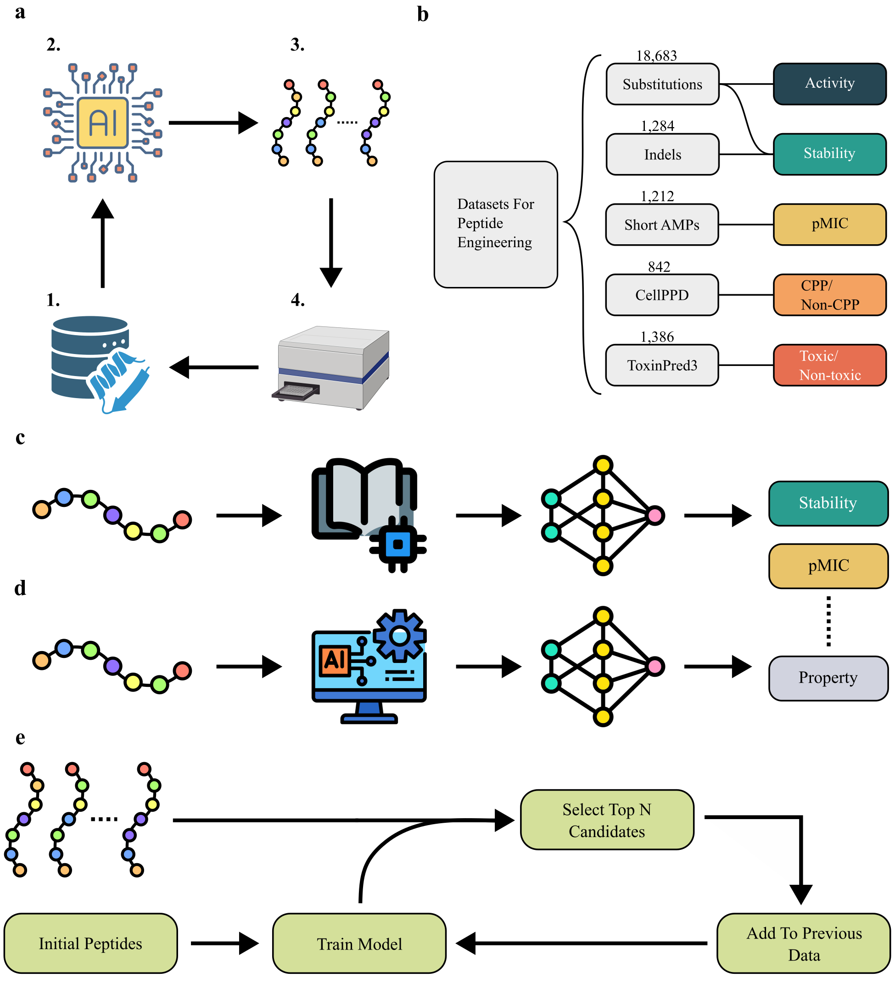

# SCARSE: Small-sample Classification And Regression Solution for low-resource peptide Engineering
<p align="center">
  
</p>

## Abstract
Being able to predict peptide properties under low-data conditions is paramount for early-stage AI-guided peptide engineering. In this study, we introduce SCARSE, a machine learning approach leveraging ESM-2, gaussian process regressor, and extremely randomized trees classifier to model peptide properties at low-resource conditions, with training sizes ranging from 20 to 500 samples. We perform a comprehensive benchmark across 23 peptide and small-protein datasets, encompassing substitutions, indels, antimicrobial peptides, cell penetrating peptides, and toxic/non-toxic peptides. The protein language model approach outperforms baseline, while also achieving high predictive performance even at very low-data settings. We further evaluate SCARSE in simulated sequential active learning experiments that emulate iterative peptide discovery workflows, where model-guided selection consistently outperformed random sampling. Finally, we show that as few as 50 characterized peptides can be enough to estimate the end-point performance of workflow simulations, providing researchers with a procedure of verifying SCARSE suitability to their data. 

## Tested for Python version
- Python version == 3.12.10

## Setup
```
pip install scarse
```

## Usage

### For training on regression problem:
```
import scarse

scarse.train(data_path="../app/train.csv", 
             classification=False, 
             seq_col="sequence",
             score_col=["score"])
```
### For training on classification problem:
```
import scarse

scarse.train(data_path="../app/train.csv", 
             classification=True, 
             seq_col="sequence",
             score_col=["classes"])
```
### For predicting after model have been trained:
```
df_pred = scarse.pred(data_path="../app/test.csv", seq_col="sequence")
```

## Tutorials
See the following tutorial, structured as a Python notebook:
* [tutorial.ipynb](tutorial.ipynb)

## Citation
Coming soon!
